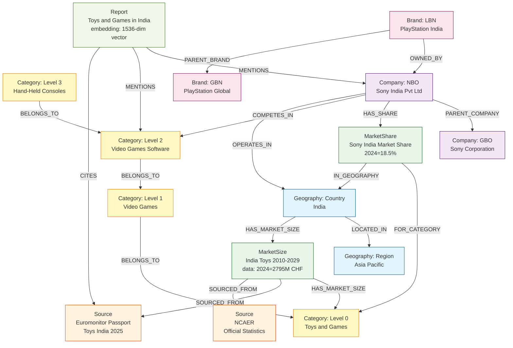
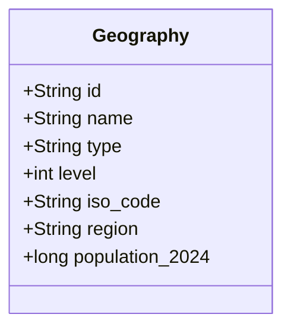
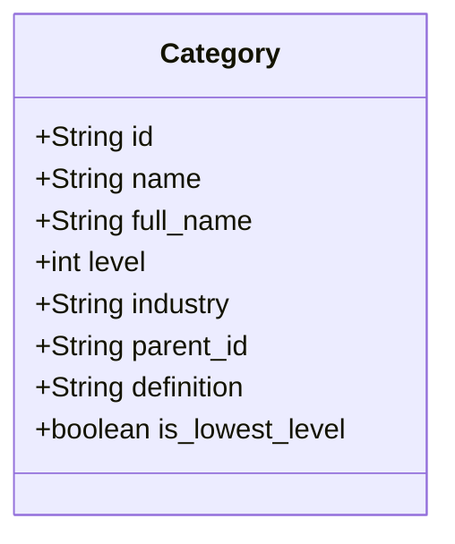
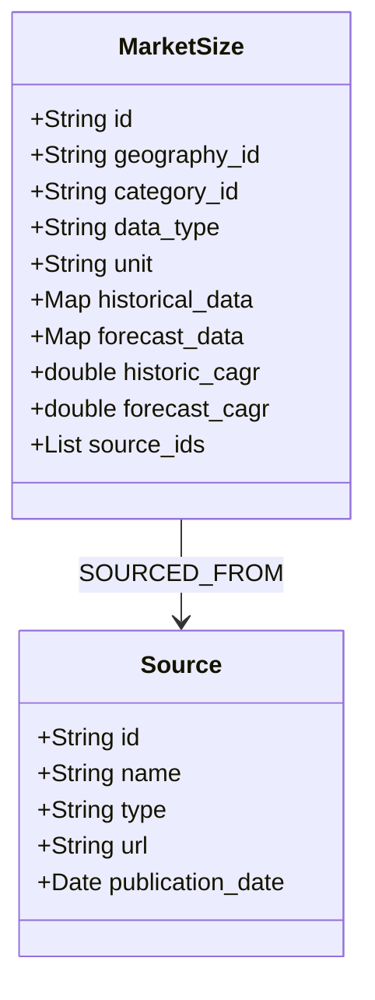
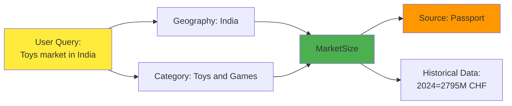
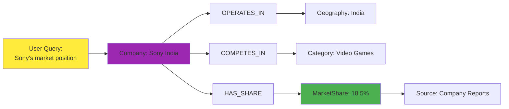
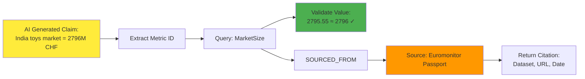
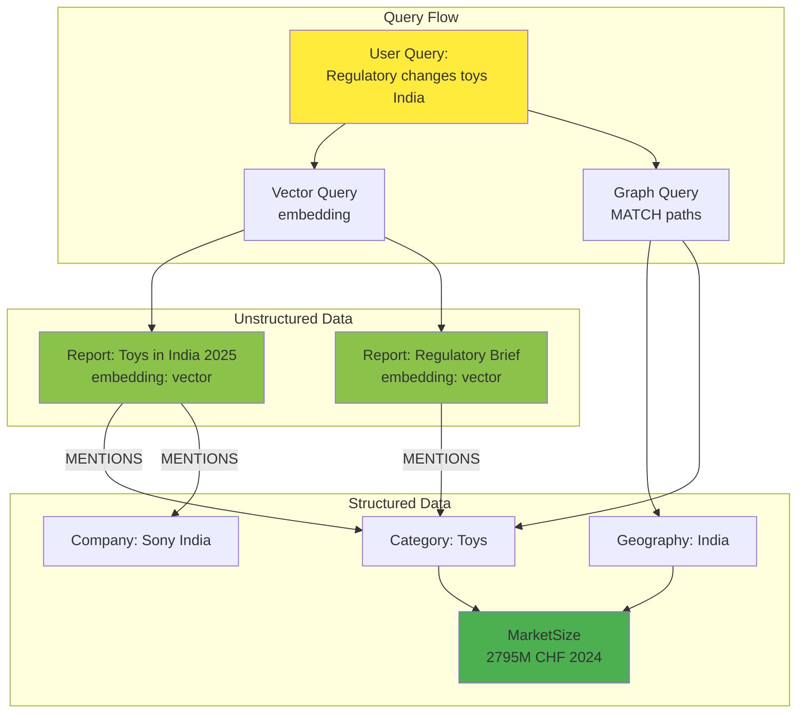

# Knowledge Graph Ontology Visualization

## Core Ontology Diagram

## Detailed Node Structure

### Geography Node

### Category Node

### MarketSize Node

## Relationship Types Summary

| Relationship | From | To | Purpose |
|--------------|------|-----|---------|
| `LOCATED_IN` | Geography (Country) | Geography (Region) | Geographic hierarchy |
| `BELONGS_TO` | Category (child) | Category (parent) | Category taxonomy |
| `HAS_MARKET_SIZE` | Geography/Category | MarketSize | Data linkage |
| `SOURCED_FROM` | MarketSize/MarketShare | Source | Citation tracking |
| `OWNED_BY` | Brand | Company | Brand ownership |
| `PARENT_COMPANY` | Company (NBO) | Company (GBO) | Corporate hierarchy |
| `COMPETES_IN` | Company | Category | Market participation |
| `OPERATES_IN` | Company | Geography | Geographic presence |
| `HAS_SHARE` | Company/Brand | MarketShare | Market share data |
| `MENTIONS` | Report | Category/Company/Brand | Content reference |
| `CITES` | Report | Source | Report citations |

## Example Query Paths

### Path 1: Market Size Query

### Path 2: Company Analysis

### Path 3: Citation Validation

## Hybrid: Structured + Unstructured (Phase 3)

---

## How to View This

### In GitHub/GitLab:
Markdown files with Mermaid diagrams render automatically in most Git UIs.

### In VS Code:
1. Install extension: "Markdown Preview Mermaid Support"
2. Open this file: `docs/ontology-visualization.md`
3. Press `Cmd+Shift+V` (Mac) or `Ctrl+Shift+V` (Windows) to preview

### In Browser:
Copy the Mermaid code to https://mermaid.live for interactive editing.

